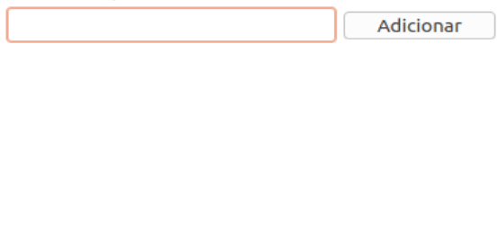

# Manipulação de HTML com DOM

Crie uma página web com o seguinte comportamento:

Ou seja, uma página com uma caixa de texto e um botão. Ao clicar no botão, o conteúdo da caixa de texto é adicionado como um novo item de uma lista exibida logo abaixo.
